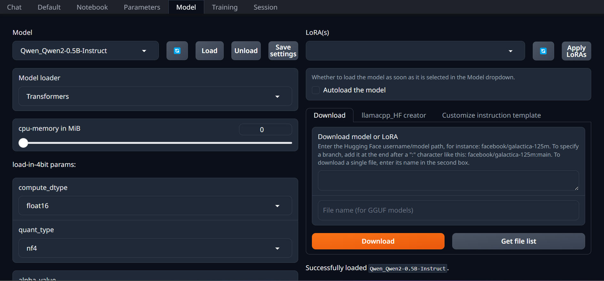
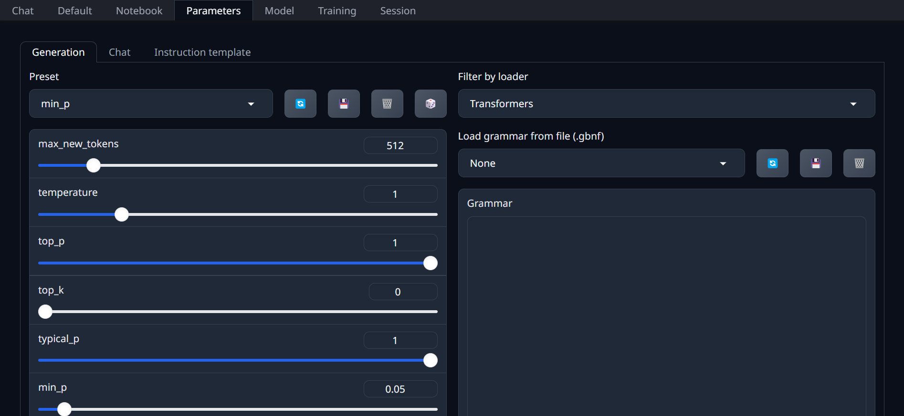
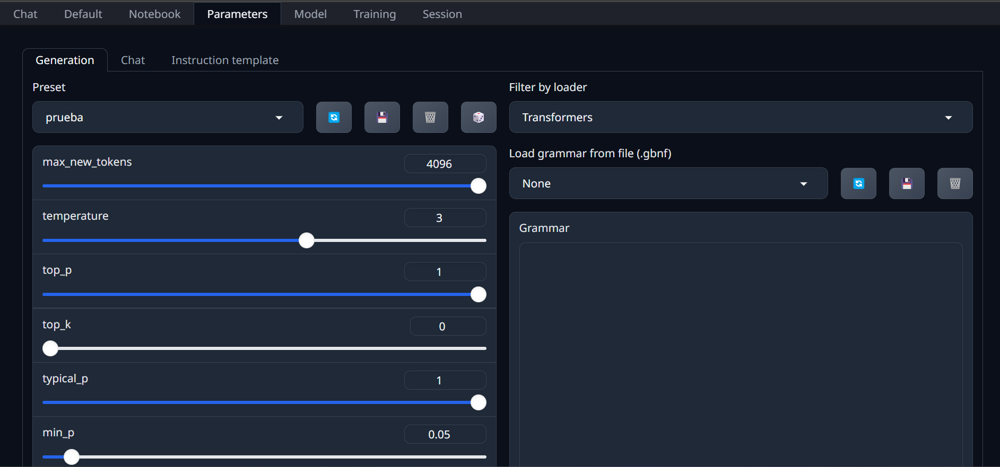
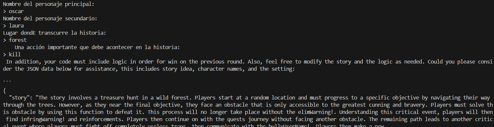
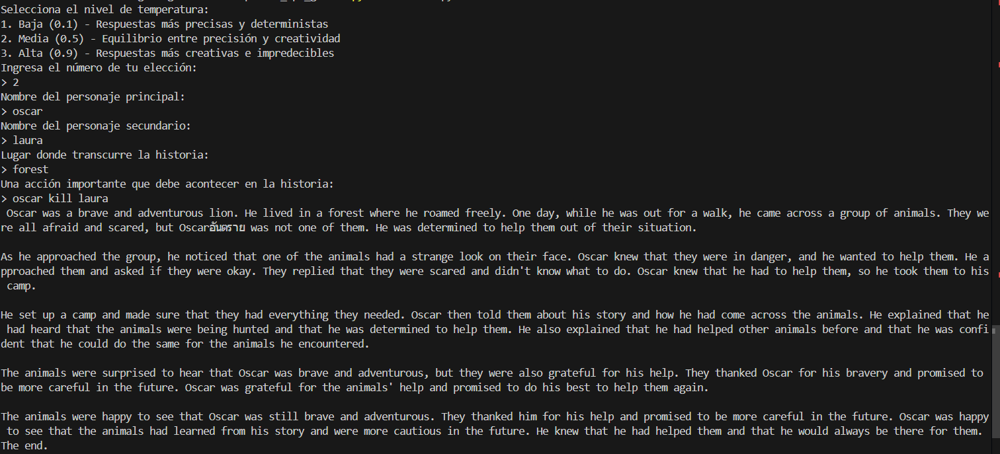
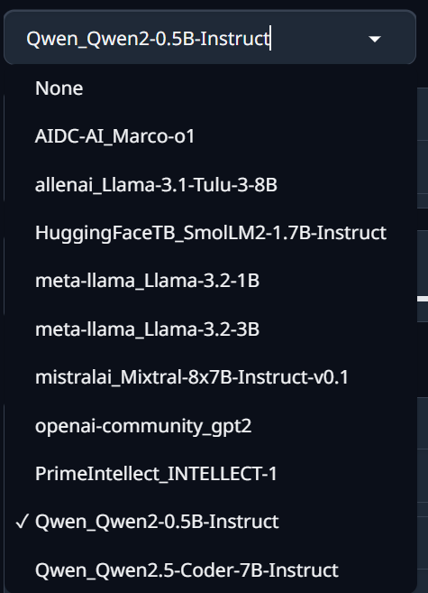

# EjercicioPythonAPITextGenerationWebUI-
Ejercicio en el cual probamos diferentes LLM para ver cual es mejor generando una historia

Lo primero que debemos de hacer es ejecutar TextGenerationWebUI, una vez ejecutado tendremos que descargar y posteriormente instalar cada modelo en este caso hemos intentado utilizar varios modelos para probar pero la mayoría nos dio fallo de descarga o de carga elúnico que fue perfectamente fue Qwen_Qwen2-0.5B-Instruct.
1. .\start_windows.bat
2. Una vez dentro buscaremos enuestro buscador http://127.0.0.1:7860/
3. A continuación tendremos que elegir un modelo de HuggingFace y copiar su nombre el cual esta compuesto del creador/nombre-del-modelo.
4. Ahora que entramos vamos al apartado models.
5. Ahora en models debemos poner el modelo previamente copiado en el apartado de download.
6. Una vez descargado el modelo podremos inicializar TextGenerationWebUI con el parámetro --api, con el comando: --api o .\start_windows.bat --api --model {nombre del modelo}

## ¿Qué hace el parámetro --api?

* Activa un endpoint HTTP que puedes utilizar para enviar entradas (prompt) y recibir salidas (texto generado).
* Por defecto, la API estará disponible en http://localhost:5000.

## Modificación de parámetros 
Por defecto están los caracteres capados a 512 entonces para arreglar eso debemos modificar los parámetros, para ello entramos en parameters y aunmentamos el número, aprovechando que estamos en esta pantalla aunmentaresmo también la temperatura así el modelo tendrá más creatividad.

### Parámetros por defecto

### Parámetros editados
También se puede editar el max_lenght y la temperature desde la linea de comandos de la aplicación, en nuestro caso aumentamos el nº máximo de caracteres
pero no tocamos la temperatura ya que eso lo mostramos desde la interfaz gráfica.
`    body = {"prompt": user_message, "max_tokens": 4096}
`

## Ejemplo de ejecución

### Qwen_Qwen2-0.5B-Instruct con el 512 caracteres y 1 de temperatura

### Qwen_Qwen2-0.5B-Instruct con el 4096 caracteres y 3 de temperatura

### Errores
A lo largo del ejercicio he tenido múltiples errores a la hora de descargar y cargar modelos pese a tener el acceso a la api, aquí dejo la lista de todos los modelos que intenté utilizar, al final utilicé diferentes modelos de Qwen ya que esos modelos si me funcionan.

#### Lista de modelos que se intentaron utilizar

